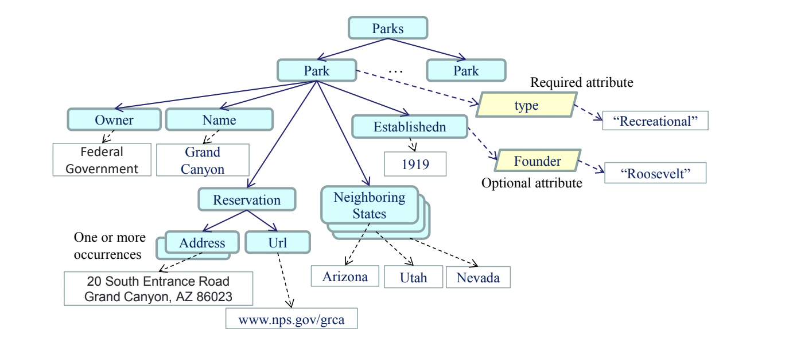

# XML_Web_Services
In this project a XML file and XSD file is created which follows the below structure.

Web service (.svc) containing below Web operations are created:
- Web operation “verification” takes the URL of an XML (.xml) file and the URL of the
corresponding XMLS (.xsd) file as input and validates the XML file against the corresponding
XMLS (XSD) file. The Web method returns “No Error” or an error message showing the available
information at the error point. You must use the files that you created in this assignment, with and
without fault injection, as the test cases.
- Web operation “search” takes the URL of an XML (.xml) file and a key (e.g., the element name
Headquarter) as input. It returns the node’s content information related to the search key, for
example: park name, number, departure port, etc. This program must also read any attributes.
Attributes are also searched. If there are multiple occurrences, it returns all of them. In
this question, DOM model is used. In the GUI the output is shown.
There are some xml files available in the XMl_files folder
that can be used to test the program. It also contains some screenshots depicting the output of the
programs.
# Running the program
- To run the program, open the program in Visual Studio. Right click the Service.svc file and then
  select Run in Browser option. This would start the service. Service Reference for this service is
  already added in UI Service which is a ASP .NET Web Service. Then hit F5, it will start the UI.  
